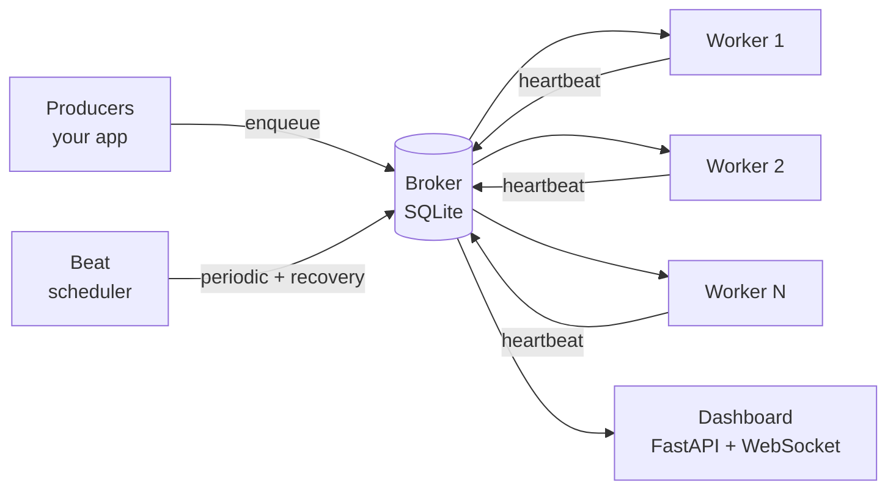
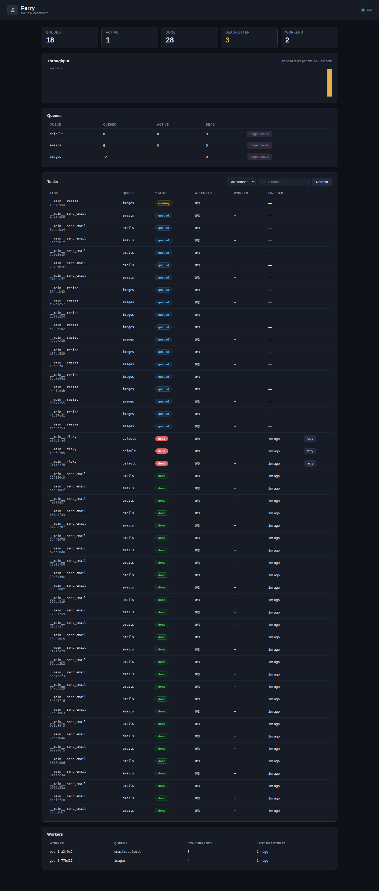

# Ferry ⛴

[](https://github.com/Sanjays2402/ferry/actions/workflows/ci.yml)
[](https://www.python.org/)
[](LICENSE)

**Ferry carries your background work across the river.** A lightweight distributed task queue for Python — SQLite-simple to start, production-serious when it counts: priorities, retries with backoff, delayed and cron-scheduled tasks, a dead-letter queue, and a live dashboard.

```python
from ferry import Ferry

app = Ferry("myapp", broker="sqlite:///ferry.db")

@app.task(queue="emails", max_retries=5)
def send_email(to: str, subject: str) -> str:
    ...  # talk to your SMTP provider

result = send_email.delay("ada@example.com", subject="welcome aboard")
print(result.get(timeout=30))  # blocks until done
```

```bash
ferry worker myapp:app --concurrency 8   # run workers
ferry beat myapp:app                     # run the scheduler (one per broker)
ferry dashboard --port 8000              # live dashboard at localhost:8000
```

## Why Ferry

Most task queues make you choose: **simple** (a Redis list and hope) or **serious** (Celery's operational sprawl). Ferry starts with a single SQLite file — no broker to install, no daemon to babysit — and grows with you:

- **Atomic claiming** — tasks are claimed with a single `UPDATE … RETURNING`, so any number of workers across processes and machines share one broker with zero double-execution.
- **Real retry semantics** — exponential backoff with jitter, per-task tunables, and a dead-letter queue for poison messages.
- **Scheduling built in** — `countdown`/`eta` for delayed tasks, cron expressions for periodic ones, with dedup so a schedule slot never enqueues twice.
- **Crash recovery** — workers heartbeat; the beat requeues tasks claimed by workers that died mid-flight.
- **Live dashboard** — queue depth, throughput chart, per-task drill-down, worker list, one-click retry and purge.

## Features

| Area | Details |
|---|---|
| Queues | Named queues, per-task priority (higher runs first, FIFO within a level) |
| Retries | `max_retries`, exponential backoff + jitter, `retry_backoff_base`/`max` per task |
| Scheduling | `countdown`, `eta`, `@app.periodic("*/5 * * * *")` cron |
| Reliability | Dead-letter queue, stale-claim recovery, graceful worker shutdown |
| Observability | Events API (`task_enqueued/succeeded/failed/dead`), live dashboard |
| Payloads | JSON with datetime/date/UUID/bytes/set support; strict errors on the rest |
| Brokers | SQLite out of the box (WAL mode); Redis via `redis://` URLs |

## Architecture



Workers are stateless and horizontally scalable — point any number of them at the same broker file (or Redis URL) and they coordinate through atomic claims. The beat is the only singleton: run exactly one per broker.

## Project layout

```
ferry/
├── __init__.py        public API
├── app.py             Ferry app, @app.task / @app.periodic, Task.handle
├── broker.py          SQLite broker: enqueue, atomic claim, ack, stats
├── redis_broker.py    Redis broker: same API, Lua-atomic claims, sorted-set queues
├── worker.py          thread-pool worker, retries, graceful shutdown
├── scheduler.py       beat: cron scheduling + stale-claim recovery
├── cron.py            cron expression parser
├── results.py         AsyncResult / TaskFailed
├── events.py          in-process lifecycle event bus
├── dashboard.py       FastAPI app + WebSocket live feed
├── static/            dashboard UI (no build step)
├── cli.py             `ferry worker|beat|dashboard|stats|purge`
└── serialization.py   strict JSON codec for args/results
tests/                 57 tests: broker, worker, retries, cron, beat, dashboard, redis
examples/              quickstart, fan-out/fan-in
```

## Task options

```python
@app.task(
    queue="emails",       # which queue it lands on
    priority=10,          # higher runs first
    max_retries=5,        # retries after the first attempt
    retry_backoff_base=5, # seconds; delay = base * 2**attempt, capped…
    retry_backoff_max=600,
    name="emails.send",   # defaults to module.qualname
)
def send_email(to, subject): ...
```

Enqueue with overrides per call:

```python
send_email.apply_async(args=("a@b.c",), kwargs={"subject": "hi"},
                       queue="bulk", priority=1, countdown=3600)
```

## Dashboard

`pip install "ferry[dashboard]"`, then `ferry dashboard`. You get queue depth, a per-minute throughput chart, a filterable task table with one-click retry of dead tasks, queue purge, and a live worker roster — all pushed over a WebSocket, no page reloads.



## Performance

`python benchmarks/bench.py` — end-to-end throughput (enqueue → execute → result) for no-op tasks on the SQLite broker:

| Tasks | Concurrency | Throughput |
|---|---|---|
| 2,000 | 8 | **~1,275 tasks/sec** |

Measured on a 2-vCPU Linux VM, Python 3.12. Queue overhead per task is well under a millisecond; your task's own runtime dominates in practice.

## How it compares

| | Ferry | Celery | RQ | Dramatiq |
|---|---|---|---|---|
| Broker to get started | SQLite file (zero setup) | Redis/RabbitMQ | Redis | Redis/RabbitMQ |

### Scaling past one box

When a single SQLite file isn't enough, point Ferry at Redis — same API, same guarantees:

```python
app = Ferry("myapp", broker="redis://localhost:6379/0")
```

Claims run as one atomic Lua script (move due delayed tasks, pop the highest-priority task), so workers stay exactly-once across machines with no extra coordination. Needs `pip install "ferry[redis]"`.
| Priorities | ✅ | ✅ (kombu) | ❌ | ❌ |
| Cron scheduling | ✅ built in | ✅ (beat) | ❌ (needs rq-scheduler) | ✅ |
| Dead-letter queue | ✅ | ✅ | ❌ | ✅ |
| Live dashboard | ✅ built in | ❌ (flower, separate) | ✅ (rq-dashboard) | ❌ |
| Dependencies (core) | **zero** | many | redis | pika/redis |

## Development

```bash
pip install -e ".[dev]"
pytest
```

CI runs the suite on Python 3.10–3.13.

## License

MIT — see [LICENSE](LICENSE).
